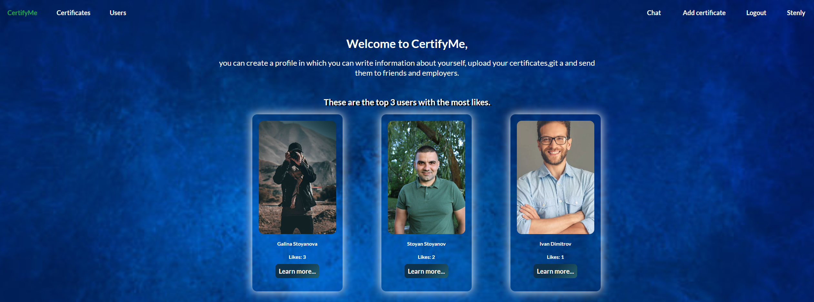
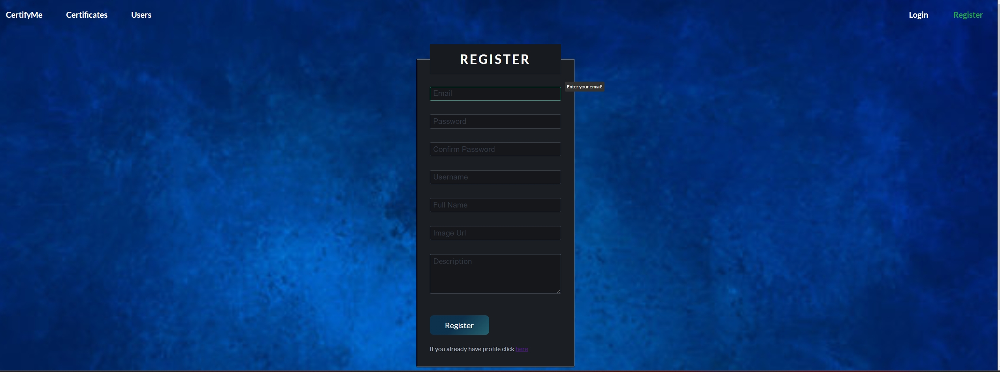
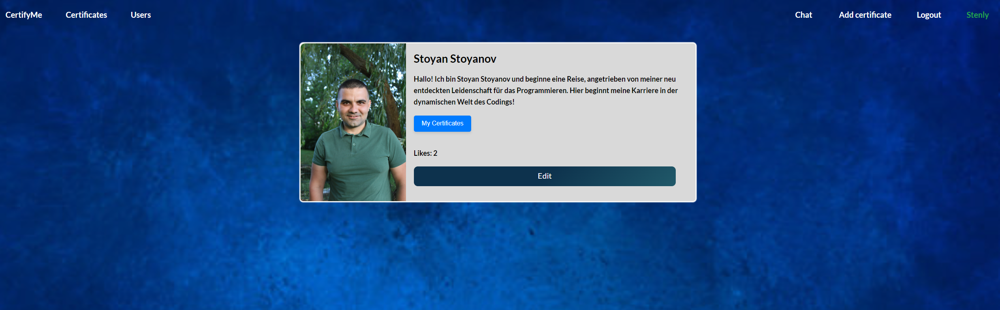
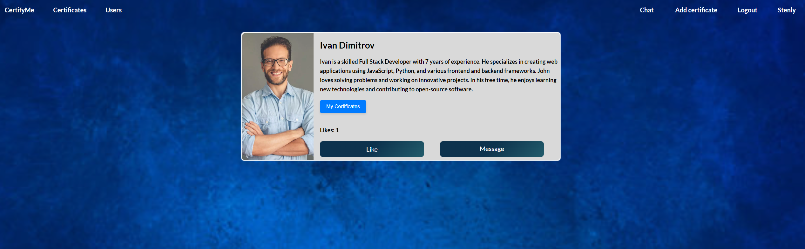

<h1>The server has been deployed and is now accessible at <a href="https://certify-me-3pfh.onrender.com/">https://certify-me-3pfh.onrender.com/</a>.</h1>

<h1>Hello, this is my project where you can create a profile in which you can write information about yourself, upload your certificates, and send them to friends and employers. Additionally, users can chat with each other.</h1>

<h2>1.Home</h2>

This is the home page, it contains some information and displays the top 3 users with the most likes.

<h2>2. Register</h2>

Here you can register and your information will be stored in a MongoDB database. The password is hashed, and there is validation for each required input. If the rules are not followed, an error message will appear in the respective field. If there is a server error, the error will be displayed next to the button. When the mouse hovers over a field, information on what needs to be entered will appear. After a successful registration, you remain logged into the new account.

<h2>3. Profil</h2>

This section contains more details about the profile, including all the information the user has provided. You can see the certificates the user has, and if you are the profile owner, you can edit your profile information. If you are not the owner, the 'Edit' button will not be visible to you.

<h2>4. Other profil and likes</h2>

This section is visible when a logged-in user views another user's profile. Depending on whether the logged-in user has liked the profile, the button will toggle between "Like" and "Unlike." Access to this information does not require registration. However, if the user is a guest and not logged in, the button will not be displayed.

<h2>5. Chat Overview</h2>

This section displays your chats. Each chat shows a snippet of the last message along with the name of the user you're chatting with, the time, and the date of the last message. Unread messages are highlighted in a different color. The navigation bar shows the count of unread chats, so you can easily see if there are any messages you haven't read yet.

<h2>6. Correspondence with a User</h2>

This is your correspondence with the given user. When you are here, any unread chat automatically becomes read. You can send your desired message.

<h2>7. Add Certificate</h2>

Here you can create a new certificate, and there is validation for each field. When the mouse hovers over a field, information on what needs to be entered in that field is displayed. Upon successful creation, you are redirected to all your certificates. The certificates are stored in the database and are linked to your profile.

<h2>8. Certificates</h2>

Here you can view all the certificates uploaded by all users. Each page displays 8 certificates, and when there are more than 8, a new page is created. Only the certificates designated for the current page are loaded. If you haven't uploaded a photo or if the photo cannot be loaded, it will be replaced with a placeholder image indicating that no photo is available.

<h2>9. Certificate Detail</h2>

Here you will find more information about certificate, and if you are the creator, you will be able to edit or delete it.

<h2>10. Edit Certificate<h2>

Here you can edit your certificate, with the fields automatically populated with your previous data. The fields have the same validations and functionalities as when you first added the certificate.

